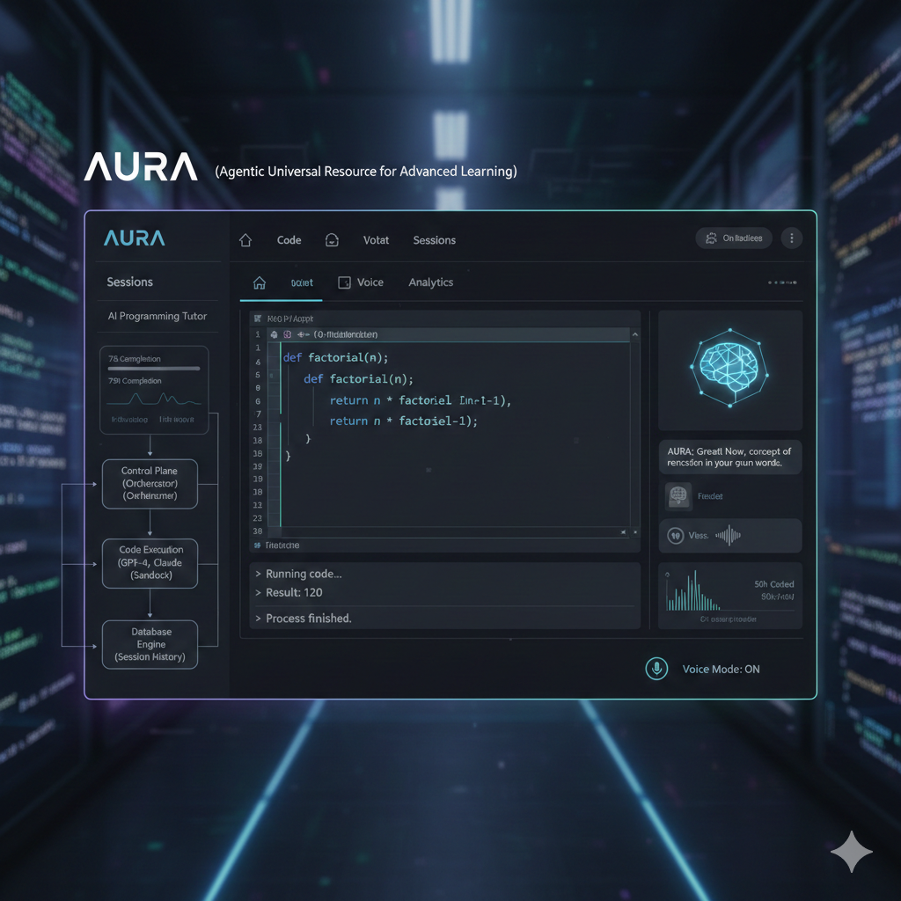

# AURA - Agentic AI Programming Tutor



**Author:** Meshack Bahati Ouma

## Overview

AURA (Agentic Universal Resource for Advanced learning) is a comprehensive AI-powered programming tutor that provides personalized, interactive coding education across multiple programming languages. Built with a sophisticated control plane architecture and powered by state-of-the-art LLMs, AURA creates an engaging learning experience that adapts to each student's progress.

## Core Features

### 🌐 Multi-Language Code Execution
- **6 Programming Languages**: Python, JavaScript, Go, Rust, C, C++
- **Integrated Workspace**: Browser-based code editor with syntax highlighting
- **Real-time Execution**: Compile and run code directly in the interface
- **Error Handling**: Clear feedback for compilation and runtime errors

### 🤖 Intelligent Tutoring
- **Context-Aware Conversations**: Remembers your entire session history
- **Interactive Learning**: Asks probing questions to verify understanding
- **Adaptive Difficulty**: Tracks proficiency and adjusts content
- **Assignment System**: Agent can push coding tasks directly to your workspace

### 🎙️ Voice Mode
- **Continuous Conversation**: Hands-free learning experience
- **Auto-Loop**: Speaks responses, listens for your input, repeats
- **Speech Recognition**: Browser-based voice input
- **Text-to-Speech**: Natural voice output

### 📚 Session Management
- **Persistent Sessions**: All conversations and code are saved
- **Tags & Categories**: Organize sessions by topic or project
- **Import/Export**: Backup and restore sessions as JSON
- **Analytics Dashboard**: Track your learning progress and statistics

## System Architecture

```
┌─────────────────────────────────────┐
│         Streamlit UI                │
│  - Voice Manager                    │
│  - Ace Code Editor (6 languages)   │
│  - Session Management               │
│  - Analytics Dashboard              │
└──────────┬──────────────────────────┘
           │
┌──────────▼──────────────────────────┐
│      Control Plane                  │
│  - Safety Rules                     │
│  - Tool Validation                  │
│  - Execution Monitoring             │
└──────────┬──────────────────────────┘
           │
┌──────────▼──────────────────────────┐
│      Tool Registry                  │
│  - run_code(language)               │
│  - set_assignment()                 │
│  - ingest_document()                │
│  - analyze_image()                  │
│  - web_search()                     │
└──────────┬──────────────────────────┘
           │
┌──────────▼──────────────────────────┐
│   Tutor Agent (LLaMA 3.1)           │
│  - Planning                         │
│  - Synthesis                        │
│  - Session Context Integration      │
└──────────┬──────────────────────────┘
           │
┌──────────▼──────────────────────────┐
│    PostgreSQL Database              │
│  - Sessions & Messages              │
│  - User Profiles                    │
│  - Knowledge Base (Embeddings)      │
└─────────────────────────────────────┘
```

## Installation & Setup

### Prerequisites
- Docker & Docker Compose
- Together API key ([Get one here](https://together.ai))

### Quick Start

1. **Clone the repository**
   ```bash
   git clone https://github.com/Kyle6012/aura.git
   cd aura
   ```

2. **Set up environment variables**
   ```bash
   cp .env.example .env
   # Edit .env and add your TOGETHER_API_KEY
   ```

3. **Build and run with Docker**
   ```bash
   docker-compose up --build
   ```
   
   This will:
   - Install all language compilers (Node.js, Go, Rust, GCC/G++)
   - Set up PostgreSQL database
   - Install Python dependencies
   - Launch Streamlit on port 8501

4. **Access AURA**
   ```
   http://localhost:8501
   ```

## Usage Guide

### Starting a Conversation
1. **New Session**: Click "➕ New Session" in the sidebar
2. **Ask Questions**: Type your programming question in the chat
3. **Voice Mode (Optional)**: Toggle "Voice Mode" for hands-free interaction

### Using the Code Workspace
1. **Open Workspace**: Expand "💻 Interactive Coding Workspace"
2. **Select Language**: Choose from Python, JavaScript, Go, Rust, C, or C++
3. **Write Code**: Use the syntax-highlighted editor
4. **Run Code**: Click "▶️ Run Code" to execute
5. **View Output**: Results appear below the editor

### Getting Coding Assignments
- Ask AURA: "Give me a Python assignment on loops"
- Assignment appears in the workspace with description
- Complete the task and submit for review

### Managing Sessions
- **Tag Sessions**: Use the multiselect to categorize by topic
- **Export**: Click 💾 to download session as JSON
- **Import**: Upload JSON file to restore a previous session
- **Archive**: Hide completed sessions from the main list

### Uploading Documents
1. Click "📁 Upload Document (PDF/DOCX/ODT)"
2. Select your file
3. AURA will extract text and add it to the knowledge base
4. Ask questions about the document

## Advanced Features

### Analytics Dashboard
View your learning statistics:
- Total sessions and messages
- Recent activity (7-day window)
- Tag usage distribution
- Document count

### User Profile Tracking
AURA automatically tracks:
- Your proficiency level (fundamental → intermediate → expert)
- Topics you've covered
- Session history

### Control Plane Safety
All tool executions are:
- Validated against a whitelist
- Timeout-protected (10s code, 30s compilation)
- Sandboxed in Docker container

## Technology Stack

| Component | Technology |
|-----------|-----------|
| Frontend | Streamlit, Streamlit-Ace |
| Backend | Python 3.9 |
| LLM | Meta LLaMA 3.1-8B (via Together AI) |
| Database | PostgreSQL |
| Embeddings | scikit-learn |
| Languages | Python, Node.js, Go, Rust, GCC/G++ |
| Containerization | Docker, Docker Compose |
| Document Processing | PyPDF2, python-docx, odfpy, pytesseract |

## Environment Variables

```bash
# Required
TOGETHER_API_KEY=your_api_key_here

# Database (defaults)
DB_HOST=db
DB_PORT=5432
DB_NAME=agentic_db
DB_USER=agentic_user
DB_PASSWORD=agentic_pass
```

## Project Structure

```
agentic/
├── agentic_system/
│   ├── src/
│   │   ├── agent.py          # TutorAgent (LLM orchestration)
│   │   ├── control_plane.py  # Safety and tool routing
│   │   ├── tools.py          # Tool implementations
│   │   ├── retriever.py      # Semantic search & embeddings
│   │   ├── db.py             # Database manager
│   │   └── document_processor.py  # PDF/DOCX/ODT parsing
│   ├── requirements.txt
│   └── uploads/              # Uploaded files
├── app.py                    # Streamlit UI
├── docker-compose.yml        # Multi-container orchestration
├── Dockerfile                # Application container
└── README.md                 # This file
```

## Troubleshooting

### Docker build fails
- Ensure Docker has sufficient memory (4GB+ recommended)
- Check firewall settings for port 8501 and 5432

### Voice mode not working
- Use a modern browser (Chrome, Edge recommended)
- Grant microphone permissions
- Ensure speakers/headphones are working

### Code execution errors
- **Rust/Go/C/C++**: Ensure Docker rebuild completed successfully
- **Timeout errors**: Complex code may need optimization

### Database connection issues
- Check `docker-compose logs db` for PostgreSQL errors
- Verify environment variables in `.env`

## Contributing

Contributions are welcome! Please:
1. Fork the repository
2. Create a feature branch
3. Commit your changes
4. Push to the branch
5. Open a Pull Request

## License

This project is licensed under the MIT License.

## Author

**Meshack Bahati Ouma**

## Acknowledgments

- Together AI for LLM API access
- Streamlit community for UI framework
- Open source contributors of all dependencies

---

**AURA** - Empowering learners through intelligent, adaptive programming education.
